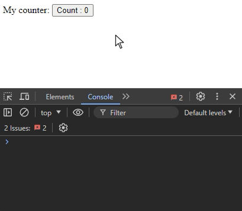

# Example Vue Web Component without embedding Vue into output file
This repo contains example build of Counter Component made in Vue that is exported as Web Component. It is being built without vue embeded, so the size of file is less than 1kB.

Example also shows how to use emits and slots of an component.

# Demonstration



# How to use

Install dependencies
```bash
npm install
```

Build component files
```bash
npm run build
```

Copy built component file to static dir
```bash
cp dist/counter-button.umd.cjs static
```

Embed component file as well as Vue dependency
```html
<head>
    ...
    <script src="https://unpkg.com/vue@3.4.31/dist/vue.runtime.global.prod.js"></script>
    <script src="/counter-button.umd.cjs"></script>
</head>
```

Use the component in any place in HTML
```html
<body>
    <counter-button id="counter-button">
        <span slot="label">My counter: </span>
        Count
    </counter-button>
    <script>
        document.getElementById("counter-button").addEventListener("change", (ev) => {
            console.log("New number is: ", ev.detail[0])
        });
    </script>
</body>
```
